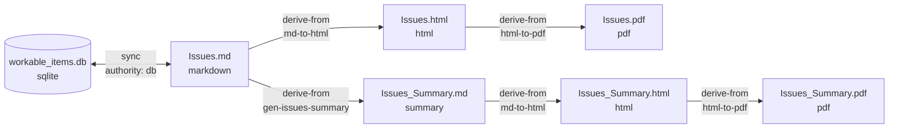
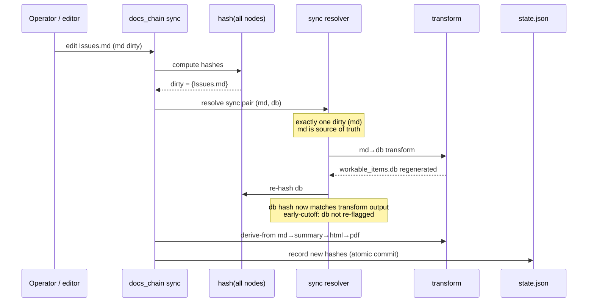
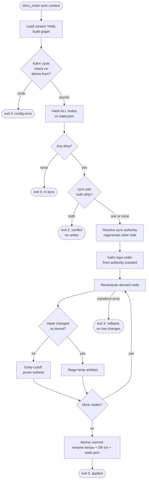
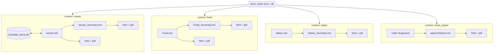

# docs_chain — System Architecture

**Revision:** 1
**Last modified:** 2026-05-29T00:00:00Z
**Status:** Design documentation — see per-section status tags (IMPLEMENTED vs PLANNED (Phase N))
**Authority:** Operator mandate 2026-05-29 (docs_chain initiative)
**Design provenance:** authoritative Phase-0 DESIGN / RESEARCH / PLAN live in the consuming project research tree (`docs/research/docs_chain/`); this document is the self-contained specification.

---

## Status legend

Per the anti-bluff no-guessing mandate (§11.4.6), every architectural
component below carries an explicit implementation-status tag:

- **IMPLEMENTED** — code exists in `docs_chain/*.go` and behaves as
  described.
- **PLANNED (Phase N)** — designed in the Phase 0 artefacts, scheduled
  for Phase N of `PLAN.md`, NOT
  yet built.

At the time of writing, the Go package tree under `docs_chain/` contains
only `go.mod` and an `internal/` scaffold (Phase 1 owns the engine).
Therefore **every behavioural component in this document is PLANNED**
unless a future revision of this file marks it IMPLEMENTED. This document
describes the DESIGNED system; it does not claim working behaviour that
is not yet built.

---

## 1. What docs_chain is

docs_chain is a universal, Go-implemented, **bidirectional
document-and-database dependency-propagation engine**. When any member of
a registered chain changes — a Markdown source, an HTML/PDF export, or a
SQLite database — docs_chain detects the change by **content hash** and
propagates it through every connected member in every declared direction,
regenerating and re-exporting as needed, so that no tracked artefact can
fall out of sync.

The engine is the mechanical successor to the project's ad-hoc sync
scripts (`sync_issues_docs.sh`, `sync_all_markdown_exports.sh`,
`generate_issues_summary.sh`, `generate_fixed_summary.sh`,
`sync_asset_player_status.sh`, and siblings). It supersedes them without
breaking them during migration: each script is wrapped as an `exec:`
transform until its logic is migrated into a builtin (see §10).

The recommended conceptual model (from
`RESEARCH.md` §9) is
**Salsa-style content-hashed incremental recomputation over a DAG**, with
Kahn topological ordering, early-cutoff, declared-authority bidirectional
edges, and atomic-rename + SQLite-transaction commit.

---

## 2. The DAG model

**Status: PLANNED (Phase 1 — graph; Phase 2 — node adapters).**

A **context** owns one or more **chains**. A chain is a directed graph of
**nodes** connected by **edges**.

### 2.1 Node kinds

Each node kind is a typed adapter (DESIGN §6). A node stores its
last-known content hash in the chain state file.

| Node kind        | Role                        | Notes |
|------------------|-----------------------------|-------|
| `markdown`       | canonical `.md` source      | input node (Salsa "square") |
| `html`           | pandoc-derived export       | derived |
| `pdf`            | weasyprint-derived export   | derived |
| `sqlite`         | a database                  | input AND derived (bidirectional) |
| `summary`        | generated Markdown digest   | e.g. `Issues_Summary.md` |
| `status`         | §11.4.45 status doc         | derived |
| `status_summary` | §11.4.56 two-audience digest| derived |
| `fingerprint`    | roster/corpus sidecar       | §11.4.86 member-list hash |

### 2.2 Edge kinds

- **`derive-from`** (one-way): the target is regenerated from one or more
  sources via a transform. Examples: `html ← markdown`, `pdf ← html`,
  `summary ← markdown`.
- **`sync`** (bidirectional): two nodes are mutually authoritative views
  of the same data. Example: `markdown ↔ sqlite` (§11.4.93). A `sync`
  edge is NOT a literal 2-cycle; it is a **paired relation with a
  declared `authority` plus two transforms** (`md→db` and `db→md`). See
  §5.

### 2.3 DAG example (Mermaid)

The canonical issues chain (§11.4.93 / §11.4.12):



### 2.4 DAG example (ASCII)

```
                    sync (authority: db)
   workable_items.db <==================> Issues.md
   (sqlite, input+derived)               (markdown, input)
                                              |
                  +---------------------------+---------------------------+
                  |                           |                           |
          derive-from                 derive-from                 (state.json
          gen-issues-summary          md-to-html                   records each
                  |                           |                    node's hash)
                  v                           v
          Issues_Summary.md            Issues.html
          (summary)                    (html)
                  |                           |
          derive-from md-to-html      derive-from html-to-pdf
                  v                           v
          Issues_Summary.html          Issues.pdf
                  |                          (pdf)
          derive-from html-to-pdf
                  v
          Issues_Summary.pdf
```

---

## 3. Content-hash change detection (NOT mtime)

**Status: PLANNED (Phase 1 — `internal/hash`).**

Change detection keys on **content hash**, never on modification time.
This directly encodes the §11.4.86 forensic lesson: `git checkout` resets
mtime, so an mtime-based fingerprint silently misses real content drift
and falsely flags unchanged files. Build-tooling practice (Bazel / Buck2
content-addressing, `RESEARCH.md`
§3) corroborates the same choice.

- Per node: `sha256(canonicalised content)`.
- Per multi-member fingerprint node (roster/corpus): `sha256` of the
  **sorted member list** — the existing §11.4.86 pattern.
- mtime is used ONLY as a cheap pre-filter to avoid re-reading unchanged
  files; it is never the authority.

A node is **dirty** when its freshly-computed hash differs from the hash
recorded in `state.json`.

---

## 4. Early-cutoff incremental recompute

**Status: PLANNED (Phase 1 — early-cutoff prune; Phase 3 — orchestrator).**

Early-cutoff is the load-bearing Salsa feature
(`RESEARCH.md` §1). At every
derived node:

1. Recompute the node from its sources via its transform.
2. Hash the result.
3. If the new hash equals the stored hash, **prune the subtree** — no
   downstream work, no write.

This means `md → db → summary → html → pdf` does NOT cascade work when an
edit is a no-op at a downstream layer (for example, a Markdown
whitespace-only edit that the summary generator normalises away stops the
chain at the summary node). Early-cutoff is also what prevents the
bidirectional `md ↔ db` edge from oscillating (§5).

---

## 5. Bidirectional sync-edge authority + conflict semantics

**Status: PLANNED (Phase 3 — sync-edge authority resolution).**

A naïve `md ↔ db` edge is a 2-cycle that would loop forever. docs_chain
resolves it with a declared-authority algorithm (DESIGN §3):

1. On a change event, hash ALL nodes and compare to stored hashes → the
   **dirty set**.
2. For a `sync` pair, if **exactly one** side is dirty, that side is the
   **source of truth for this run**; the other side is regenerated from
   it via the appropriate transform (`md→db` or `db→md`).
3. If **both** sides are dirty (a concurrent edit on each side),
   docs_chain **stops and emits a conflict** — exit non-zero, no writes.
   The operator resolves it (§11.4.66). No silent merge, no guessing
   (§11.4.6).
4. After regenerating the non-authoritative side, its new hash is
   recorded. Because the hash now matches what the transform produced,
   **early-cutoff** prevents it from being re-flagged dirty on the next
   pass → no loop.

The `authority:` field in the edge config (§7) names the default source
of truth for a `sync` pair, used to disambiguate the "exactly one dirty"
case where the dirty side equals the declared authority, and used in
diagnostics.

### 5.1 Bidirectional md↔db sync (Mermaid sequence)



### 5.2 Both-dirty conflict (ASCII)

```
   edit A on Issues.md          edit B on workable_items.db
            \                            /
             v                          v
        dirty = { Issues.md , workable_items.db }
                          |
                  sync resolver: BOTH dirty
                          |
                          v
            CONFLICT  ->  exit 2, ZERO writes
            (operator resolves per §11.4.66;
             no silent merge, no guess per §11.4.6)
```

---

## 6. Kahn topological propagation

**Status: PLANNED (Phase 1 — Kahn topo-sort + cycle detection).**

Propagation runs in deterministic topological order using Kahn's
algorithm (`RESEARCH.md` §5):

- The **`derive-from` sub-graph MUST be acyclic.** docs_chain runs Kahn's
  algorithm at load; any residual nodes (a cycle) ⇒ config error and the
  engine refuses to run (exit 4).
- **`sync` pairs are collapsed to their authority** before the topo-sort,
  so the effective propagation graph is always a DAG.
- After the authority of each `sync` pair is resolved (§5),
  `derive-from` edges run from that authority outward
  (`md → summary → html → pdf`).

### 6.1 Loop / cycle prevention (defence in depth)

1. **Load-time Kahn check** — a cycle in `derive-from` ⇒ refuse to run.
2. **`sync` collapse** — bidirectional edges never enter the topo-sort as
   cycles.
3. **Early-cutoff** (§4) — prevents `md↔db` oscillation.
4. **Per-run visited-set + max-iteration guard** — belt-and-suspenders
   against any unexpected oscillation: fail loudly, never spin.

---

## 7. Propagation-flow overview (Mermaid)



---

## 8. Atomicity & crash-safety (composes with §9.2)

**Status: PLANNED (Phase 3 — staging + atomic-rename commit + rollback).**

A propagation run is all-or-nothing (DESIGN §5,
`RESEARCH.md` §6):

- Each derived artefact is written to `<file>.docs_chain.tmp` in the same
  directory, then `fsync`'d.
- SQLite mutations run inside **one** transaction;
  `wal_checkpoint(TRUNCATE)` runs before commit (§11.4.95), so the
  transient `.db-wal` / `.db-shm` sidecars are safely discardable.
- **Commit phase**: atomic `rename(2)` of every staged temp over its live
  artefact, then commit the SQLite transaction, then write `state.json`.
- **Rollback**: any error before commit ⇒ delete all temps, abort the
  transaction, and leave every live artefact and the DB byte-identical to
  the pre-run state. Exit 3.
- For destructive contexts an optional pre-run hardlinked `.git` backup
  hook composes with the §9.2 zero-risk data-safety protocol.

Crash-safety claim verified by the Phase 3 / Phase 5 chaos tests
(§11.4.85): SIGKILL mid-commit leaves live artefacts byte-identical to
the pre-run snapshot (`recovery_trace.log` is the captured evidence).

---

## 9. SQLite-node integration (§11.4.93)

**Status: PLANNED (Phase 2 — sqlite↔md pluggable transform; Phase 3 —
txn/WAL commit).**

The `sqlite` node is the bidirectional pivot of the §11.4.93 single
source of truth (`docs/workable_items.db`, tracked in git per §11.4.95).
Two pluggable transforms bind it to its Markdown view:

- `md→sqlite` — parse Markdown trackers into DB rows.
- `sqlite→md` — regenerate the Markdown trackers from DB rows.

During migration both transforms shell out to the existing §11.4.93
`workable-items` Go binary (DESIGN §6) so there is zero rewrite risk. The
DB participates in the same atomic-commit phase as the file artefacts
(§8): the transaction is committed only after every staged file rename
succeeds, so a partial run never leaves the DB ahead of (or behind) the
Markdown.

### 9.1 Multi-context overview (Mermaid)

A consuming project registers several independent contexts; each is a
self-contained chain and `docs_chain sync <context>` touches only that
context's nodes.



### 9.2 Multi-context overview (ASCII)

```
   docs_chain sync --all
     |
     +-- context: issues        -> workable_items.db <-> Issues.md -> summary -> html/pdf
     +-- context: fixed         -> Fixed.md -> Fixed_Summary.md -> html/pdf
     +-- context: status        -> Status.md -> Status_Summary.md -> html/pdf
     +-- context: asset_player  -> roster fingerprint -> players/Status.md -> html/pdf
     |
   each context is independent; `sync issues` touches ONLY the issues chain.
```

---

## 10. Supersession without breakage (migration model)

**Status: PLANNED (Phase 7 — ATMOSphere wiring + retire ad-hoc scripts).**

Each ad-hoc sync script is wrapped as an `exec:` transform (DESIGN §8).
Phase 7 registers the ATMOSphere contexts pointing at the EXISTING
scripts: behaviour is identical, but now orchestrated, content-hashed,
atomic, and conflict-aware. Once a context is green for N cycles, the
script's internal re-export / parity logic migrates into docs_chain
builtins and the script retires to a thin shim that calls
`docs_chain sync <context>`.

See [`USE_CASE_CATALOGUE.md`](USE_CASE_CATALOGUE.md) for the full
script-to-context supersession table.

---

## 11. Go package layout

**Status: PLANNED (Phases 1–4).**

```
docs_chain/
  cmd/docs_chain/main.go     # CLI: sync | watch | verify | graph | doctor
  internal/graph/            # DAG, Kahn topo-sort, cycle detect, early-cutoff
  internal/hash/             # sha256 canonical content + member-list fingerprint
  internal/node/             # node kinds + adapters (uses vasic-digital/Document)
  internal/transform/        # builtin + exec transforms
  internal/orchestrator/     # dirty-set, sync-resolution, staging, atomic commit, rollback
  internal/config/           # YAML context loader + validation
  internal/watch/            # fsnotify daemon (uses vasic-digital/Watcher)
  internal/state/            # state.json read/write (§11.4.77 regen)
```

The engine reuses three catalogued `vasic-digital` modules
(`RESEARCH.md` §8):
`Document` (node-content abstraction), `Watcher` (watch daemon), and
`Lazy` (memoised node evaluation). No existing dependency-graph /
incremental-propagation engine was found, so the engine itself is
original work extending those three modules (§11.4.8).

---

## 12. CLI / daemon interface

**Status: PLANNED (Phase 4 — CLI/daemon).**

| Command                       | Behaviour | Exit codes |
|-------------------------------|-----------|------------|
| `docs_chain sync <context>`   | one-shot: detect dirty, resolve, propagate atomically, update state | 0 in-sync/applied · 2 conflict · 3 transform-fail · 4 cycle/config-error |
| `docs_chain sync --all`       | every registered context | as above |
| `docs_chain verify <context>` | read-only: report drift, write nothing (the pre-build-gate hook; the `--check-only` successor) | 0 in-sync · non-zero drift |
| `docs_chain watch [--context X]` | fsnotify daemon, debounced, runs `sync` on settle | long-running |
| `docs_chain graph <context>`  | emit the DAG (DOT/JSON) for audit | 0 |
| `docs_chain doctor`           | validate all contexts + state integrity | 0 healthy |

---

## 13. Anti-bluff binding

**Status: PLANNED (Phase 5 — comprehensive test suite).**

Every transform run captures evidence (input hashes, output hashes,
rename log) into `qa-results/docs_chain/<run-id>/` (§11.4.69 derived-
artefact feature class). `verify` is the deterministic (§11.4.50)
sink-side check that a consuming project's pre-build gate invokes. The
full four-layer test coverage per component (pre-build gate, packaging
check, runtime/e2e test, paired §1.1 meta-test mutation) is specified in
`PLAN.md` Phase 5.
