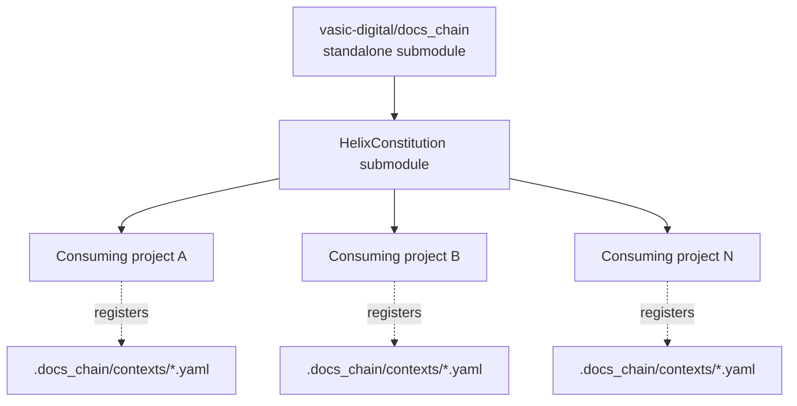

# docs_chain — HelixConstitution Integration

**Revision:** 1
**Last modified:** 2026-05-29T00:00:00Z
**Status:** Design documentation — DESCRIBES the integration. The integration itself is PLANNED (Phase 6) and OPERATOR-GATED. This document does NOT implement it.
**Authority:** Operator mandate 2026-05-29 (docs_chain initiative)
**Design provenance:** authoritative Phase-0 DESIGN / RESEARCH / PLAN live in the consuming project research tree (`docs/research/docs_chain/`); this document is the self-contained specification.

---

## Status and scope boundary

**PLANNED (Phase 6) — OPERATOR-GATED.** Phase 6 of
`PLAN.md` covers remote-repo
creation, the constitution-submodule pointer add, and the
governance-file edits (Constitution.md / CLAUDE.md / AGENTS.md / QWEN.md).
Those steps are performed by the operator, not by an agent (§11.4.66 /
§11.4.35 / §11.4.26).

This document **describes** the integration model so the operator and
future consuming projects know the plan. It is explicitly **not** an
implementation: nothing here edits any governance file, creates any
remote, or adds any submodule. The reader should treat every "the
constitution submodule will …" statement as the DESIGNED Phase 6 outcome,
not a current fact.

---

## 1. The distribution model

docs_chain ships as its own `vasic-digital` submodule and is consumed as a
CORE part of the HelixConstitution submodule. Once Phase 6 lands, any
project that already inherits the constitution submodule gets docs_chain
**by reference** — the same inheritance mechanism the project already uses
for the constitution's `CLAUDE.md` / `AGENTS.md` / `Constitution.md`.

The engine (Go binary + builtins) is shared and project-agnostic; the
**contexts** (`.docs_chain/contexts/*.yaml`) are per-project data the
consumer owns and registers. This mirrors the §11.4.28 decoupling rule:
the submodule never carries project-specific context; the consumer
injects its chains via config.

---

## 2. Inheritance model

Per §11.4.35 (canonical-root inheritance clarity), there are two layers:

- **Canonical root (the constitution submodule).** Hosts the docs_chain
  engine reference + the universal anchor describing the mandate
  docs_chain satisfies. Project-agnostic.
- **Consumer (this and every other project).** Registers its own
  `.docs_chain/contexts/*.yaml`, invokes the engine via the path the
  constitution exposes, and lists its chains in its own docs.

A consuming project does NOT copy the engine; it references it at the
path the constitution exposes (the same pattern §11.4.80 uses for the
`codegraph_*` scripts — inherited by reference, never copied).

---

## 3. Config-discovery convention

**Status: PLANNED (Phase 4 loader + Phase 6 distribution).**

The discovery convention a consuming project follows out of the box:

1. Engine resolves contexts from `<project-root>/.docs_chain/contexts/`.
2. Each `*.yaml` is one independent context (ARCHITECTURE §9).
3. `state.json` lives at `<project-root>/.docs_chain/state.json`,
   gitignored, regenerated on demand (§11.4.77 — the regeneration
   mechanism is `docs_chain sync`).
4. `docs_chain sync --all` / `docs_chain verify --all` walk every context
   file; per-context commands take the context name.

No hardcoded project paths live in the engine — every path is supplied by
the consumer's YAML (§11.4.28-B decoupling).

---

## 4. §11.4.x anchors docs_chain satisfies / supersedes

docs_chain is the mechanical engine behind a family of existing
documentation-sync mandates. Once a consuming project registers the
matching context (see [`USE_CASE_CATALOGUE.md`](USE_CASE_CATALOGUE.md)),
the engine enforces the anchor in place of the ad-hoc script.

| Anchor | What it mandates | docs_chain mechanism | Recipe |
|--------|------------------|----------------------|--------|
| §11.4.12 | Issues_Summary always-sync | derive `summary ← markdown` + early-cutoff | (a) |
| §11.4.53 | Fixed_Summary parity | derive `fixed_summary ← Fixed.md` | (b) |
| §11.4.45 | Status.md maintenance | status-doc context | (c) |
| §11.4.56 | Status_Summary two-audience parity | derive `status_summary ← Status.md` | (c) |
| §11.4.57 | README doc-link section | multi-input derive into README | (f) |
| §11.4.59 | README always-sync export | derive README `.html`/`.pdf` | (f) |
| §11.4.60 | Documentation composite-sync | the composite of all derive edges | (a)–(h) |
| §11.4.65 | Universal markdown export | derive `.html` + `.pdf` per `.md` | (e), (g) |
| §11.4.86 | Roster/corpus auto-sync (fingerprint not mtime) | `members-fingerprint` node + content-hash detection | (d) |
| §11.4.93 | Workable-items DB single source of truth | bidirectional `sync` edge `md ↔ sqlite` | (a) |
| §11.4.95 | DB tracked + WAL-checkpoint commit | atomic SQLite-txn commit phase | (a) |
| §12.10 | CONTINUATION maintenance | derive CONTINUATION exports | (h) |
| §11.4.44 | Document revision header | source-author owns header; engine keeps exports in sync | (a)–(h) |
| §9.2 | Zero-risk data safety | atomic-rename commit + rollback + optional hardlink backup | engine-wide |
| §11.4.6 | No-guessing | both-dirty `sync` → conflict (exit 2), never silent merge | engine-wide |
| §11.4.50 | Deterministic consistency | `verify` is the deterministic sink-side check; byte-stable transforms | engine-wide |
| §11.4.69 | Sink-side positive-evidence | per-run evidence to `qa-results/docs_chain/<run-id>/` | engine-wide |

docs_chain does NOT replace the authoring discipline of any anchor (e.g.
the operator still writes the §11.4.44 revision header into the source);
it replaces the **mechanical sync** the anchor requires.

---

## 5. What a consuming project gets for free vs must register

### 5.1 For free (provided by the constitution submodule once Phase 6 lands)

- The docs_chain engine (Go binary + builtins: `pandoc-html`,
  `weasyprint-pdf`, `colorize-html`, `members-fingerprint`,
  `gen-summary`, `md-to-sqlite` / `sqlite-to-md` adapters).
- The CLI (`sync` / `verify` / `watch` / `graph` / `doctor`) and exit-code
  contract.
- Atomic-commit + rollback + conflict semantics (ARCHITECTURE §5, §8).
- Content-hash change detection (§11.4.86 not-mtime).
- The use-case recipe catalogue (this submodule's
  [`USE_CASE_CATALOGUE.md`](USE_CASE_CATALOGUE.md)) as a starting point.

### 5.2 Must register (the consumer owns)

- Its own `.docs_chain/contexts/*.yaml` describing its chains.
- The `exec:` transform scripts its contexts reference (during migration —
  its existing generators).
- The `.gitignore` entries for `state.json` and `*.docs_chain.tmp`.
- The CI / pre-build wiring that calls `docs_chain verify` (operator-gated
  where it edits a gate file — Phase 7.4).
- Any project-specific node kinds beyond the universal set (rare).

---

## 6. Out-of-the-box adoption checklist

**Status: PLANNED — usable once Phase 6 distribution + Phase 4 CLI land.**

A project follows these steps to start using docs_chain:

1. Inherit the constitution submodule (already done by every governed
   project).
2. Build / obtain the `docs_chain` binary (ARCHITECTURE §11; USER_GUIDE
   §3).
3. `mkdir -p .docs_chain/contexts` and add `state.json` +
   `*.docs_chain.tmp` to `.gitignore`.
4. Copy the relevant recipes from
   [`USE_CASE_CATALOGUE.md`](USE_CASE_CATALOGUE.md), adjusting paths.
5. `docs_chain doctor` to validate every context.
6. `docs_chain sync --all` to bring everything in sync; inspect any
   conflicts (USER_GUIDE §9).
7. Wire `docs_chain verify --all` into CI / the pre-build gate
   (operator-gated where it edits a gate file).
8. Optionally run `docs_chain watch` during interactive development.

---

## 7. Phase-6 governance integration (operator-gated — described, not done)

Per `PLAN.md` Phase 6, the
operator (NOT an agent) performs:

- (6.1) create `vasic-digital/docs_chain` on GitHub + GitLab via gh / glab
  (§11.4.66 — agent must not create remotes).
- (6.2) `install_upstreams` recipes + multi-mirror push (§11.4.36 / §2.1).
- (6.3) add the docs_chain submodule to the constitution submodule
  (operator authorises the governance edit).
- (6.4) governance-file integration — the new anchor + propagation gate in
  Constitution.md / CLAUDE.md / AGENTS.md / QWEN.md (§11.4.35 / §11.4.26 —
  operator edits governance).
- (6.5) `helix-deps.yaml` manifest (§11.4.31), plus the cross-project
  bootstrap Challenge that proves a fresh consumer can register a chain
  and `sync` works with captured wire-evidence.

This documentation set is the agent-executable companion to those
operator-gated steps; it carries no governance edits itself.
